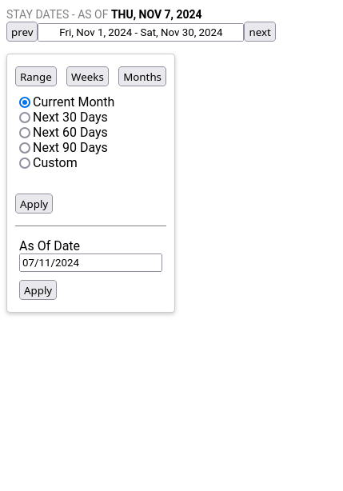

# React Booking Range Picker App

A simple React application that has a custom date range picker component that would allow users to select a date range in a variety of ways.

## Getting Started

### Prerequisites

- Node.js(LTS) and npm installed

### Installation

1. Clone the repository
```bash
git clone https://github.com/knav33n/booking-range-picker
```

2. Navigate to the project directory
```bash
cd booking-range-picker
```

3. Install dependencies
```bash
npm install
```

4. Start the development server
```bash
npm run dev
```

5. Open http://localhost:5173 in your browser to view the application

## Screenshot

*Booking Range Picker*

## Technologies Used

- React
- Redux
- Typescript
- react-datepicker (for the datepicker component)
- CSS (for styling)
- Moment.js (for date manipulation)
